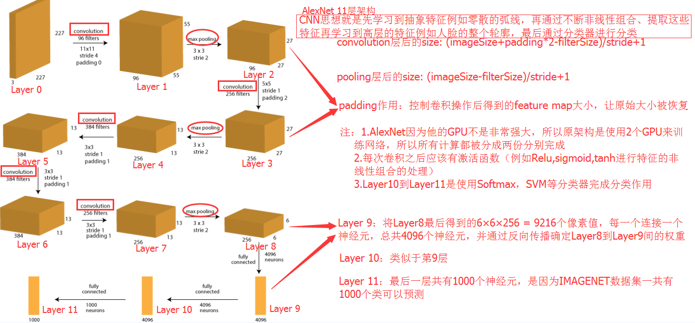
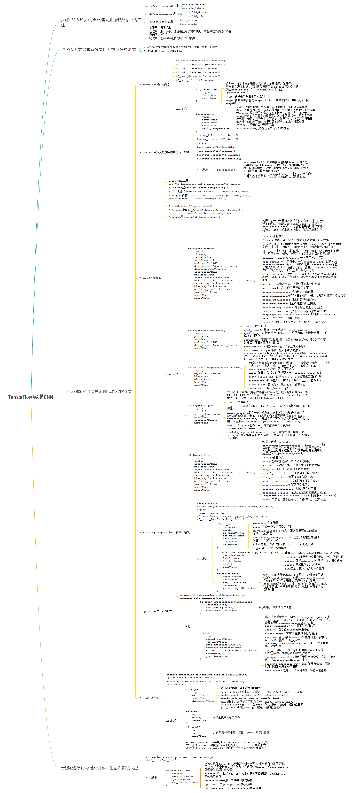
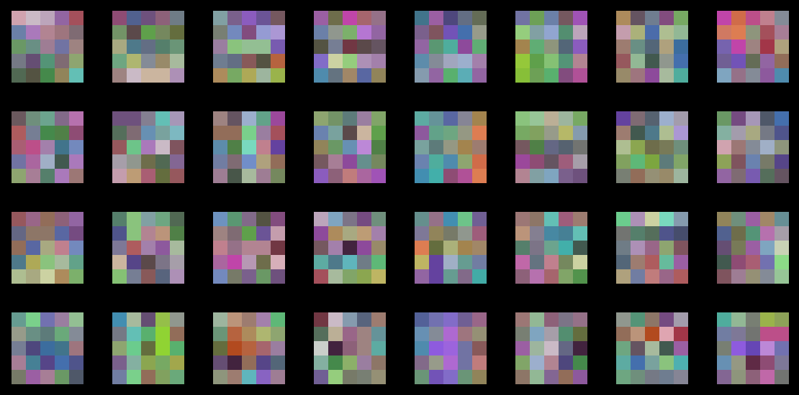
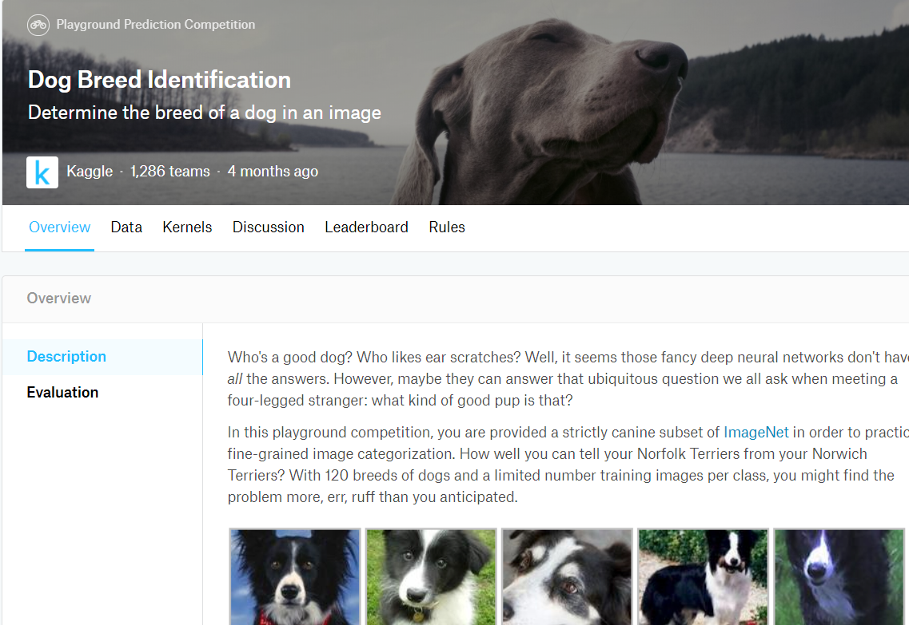
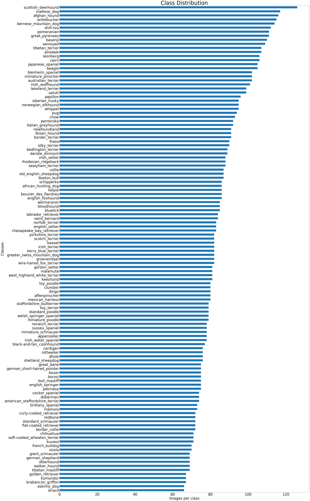
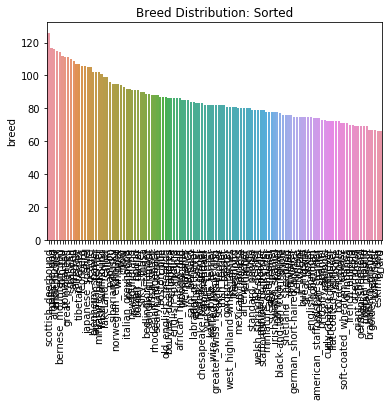

# 记录成为TF boys的心路历程：
# 一、CNN
### CNN模型所使用的数据集：
    @misc{e-VDS,
      author = {Culurciello, Eugenio and Canziani, Alfredo},
      title = {{e-Lab} Video Data Set},
      howpublished = {\url{https://engineering.purdue.edu/elab/eVDS/}},
      year={2017}
    }

## 1.CNN模型架构：
### 以AlexNet模型为例，AlexNet是IMAGENET Challenge2012的获奖解决方案，这是最受欢迎的计算机视觉挑战之一，2012年是第一次使用深度学习来解决这个问题。

## 2.使用TensorFlow训练CNN模型：

## 3.使用TensorBoard展示训练信息：
### IMAGES:

### Graph:

### SCALARS:

### DISTRIBUTIONS:

### HISTOGRAMS:

### EMBEDDINGS:

## 4.使用训练好的模型参加Kaggle CIFAR-10比赛结果：

### Visualize kernel：

## 5.训练过程中遇到的问题
### 5.1 非均衡数据集（Imbalance Data Set）的分类问题
### 以Kaggle Dog Breed Identification比赛对120种狗的品种分类数据为例（Kaggle比赛入口：[dog-breed-identification](https://www.kaggle.com/c/dog-breed-identification "dog-breed-identification") ）

### 机器学习分类算法面对不均衡数据分类时性能下降的原因很多，例如不恰当的性能评价准则、不恰当的归纳偏置、某类样本数据过少产生的绝对稀少问题、各类样本数据相差悬殊产生的相对稀少问题以及采取分而治之策略算法所独有的数据碎片问题和噪音等。

### Kaggle上网友给出的kernel将120种狗的数据可视化展示：

### 图片来自：[SebastianHuber-DogBreedDataVisualisation](https://www.kaggle.com/methindor/dogbreeddatavisualisation "DogBreedDataVisualisation") 

### 图片来自：[nh4clbreed-distribution plots](https://www.kaggle.com/placidpanda/breed-distribution-plots "distribution plot") 

### 现有的对策主要有两大方向：一是从数据集的角度，即重构数据集，通过数据预处理的方法解决；另一个是从算法角度，即改进分类算法，主要通过对不同类样本设置不同的权值、改变概率密度、调整分类边界等措施解决。
### 重构数据集
### 重构数据集，又叫重采样/重抽样/重取样，是解决数据失衡的一个有效途径。该方法主要是通过减轻数据集的不均衡程度来提高少数类的分类性能。其关键在于：如何既能消除大量的噪声信息，显著减少数据不均衡程度，又能保证最小的信息损失，以保留绝大多数对分类学习有用的样本点。重采样方法，包括过取样和欠取样。
- 过取样（Oversampling）：通过增加少数类的样本来提高少数类的分类性能，最简单的过取样方法是随机复制少数类样本，缺点是没有给少数类增加任何新的信息，会使分类器学到的决策域变小，从而导致过学习。
- 欠取样（Undersampling）：是通过减少多数类样本来提高少数类的分类性能，最简单的欠取样方法是随机的去掉某些多数类样本来减少多数类的规模，缺点是容易丢失多数类的一些重要信息。改进的方法是通过一定的规则和技术，找出边界样本和噪音样本，有选择地去掉对分类作用不大，即远离分类边界或者引起数据重叠的多数类样本，并将其从大类中去掉，只留下安全样本和小类样本作为分类器的训练集。

### 改进分类算法
### 对已有分类算法的改进，主要是通过调节各类样本之间的代价函数、对于不同类的样本设置不同的权值、改变概率密度、调整分类边界等措施使其更有利于少数类的分类。

### 5.2 训练数据集Image Size不同
### 为什么需要输入固定大小的图片？
### 事实上全连接层是制约输入大小的关键因素，因为卷积和池化层不需要输入固定大小的数据，只需要拿到前一层的Feature Map，然后做卷积池化输出，只有全连接层因为权重维度固定不能改，所以层层向回看导致所有输入都必须固定大小。
### 解决办法
### 总体有两种思路：从图像数据出发，通过Resize或者Crop统一大小；从模型出发，比如物体检测中使用的SPP-Net，取消了全连接层的设计，就可以支持任意大小输入。现实生活中我们收集的数据往往都是尺寸不同的，全部Resize对模型来说非常简单，但并不是最好的方式。且Preprocess时增大了计算成本，因此从模型入手是更好的方式。
- Resize&Crop：比如对于ImageNet，通常都是将图像的宽缩放到256, 然后再随机Crop224X224大小的图片作为训练样本。
- SPP(Spatial Pyramid Pooling空间金字塔池化)：SPP-Net思想在检测算法RFCN中用到，即在所有卷积层结束后得到不同size的feature map，然后在不同尺寸的feature map上画上固定大小的方格，在方格里面取个平均。

### 5.3 Preprocess训练数据集Resize大小问题
### 通常因为GPU计算能力受限，会将原数据集Resize到更小的大小进行训练，这种做法其实对模型影响并不大，只要Resize到人类主观可分辨的大小，理论上模型就能学习到相应的特征。

### 5.4 训练数据归一化处理
### 如果对训练数据集进行减去均值归一化处理（每个像素值都分布在0~1），则需对验证集和测试集（包括使用模型预测时）进行相同操作。

### 5.5 Data Augmentation
### 常用数据增强方法例如平移、翻转、旋转、白化等，但是本人在实际训练过程中并没有发现能给模型带来很大的效果，个人觉得CNN作为特征提取器提取一些轮廓的特征以及这些轮廓组合起来更为复杂的高级特征，最直接有效的数据增强手段应该是改变所需要识别的物体的背景轮廓复杂度，这应该是最为直接有效的，越大的训练数据集能使模型鲁棒性更好，原因也主要是大量数据所需要识别物体的背景更为复杂，CNN学习特征时能够去排除识别干扰因素。

### 参考：
- [深度学习任务面临非平衡数据问题？试试这个简单方法](https://juejin.im/entry/5b0ceb35f265da08f66516a0 "深度学习任务面临非平衡数据问题？试试这个简单方法") 
- [从重采样到数据合成：如何处理机器学习中的不平衡分类问题？](https://www.jiqizhixin.com/articles/2017-03-20-8 "从重采样到数据合成：如何处理机器学习中的不平衡分类问题？") 
- [数据增强：数据有限时如何使用深度学习？](https://www.leiphone.com/news/201805/avOH5g1ZX3lAbmjp.html "数据增强：数据有限时如何使用深度学习？") 
